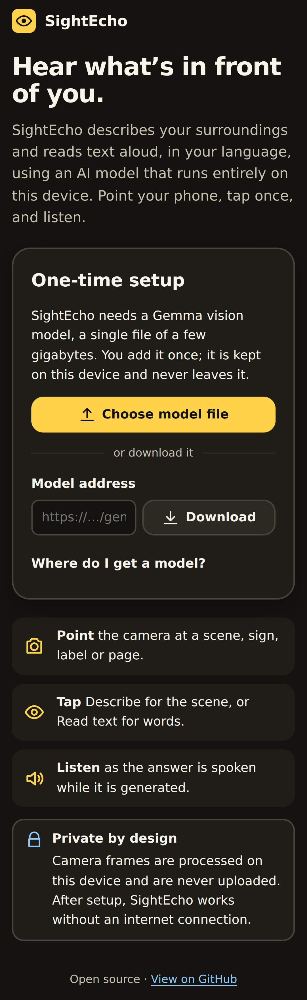
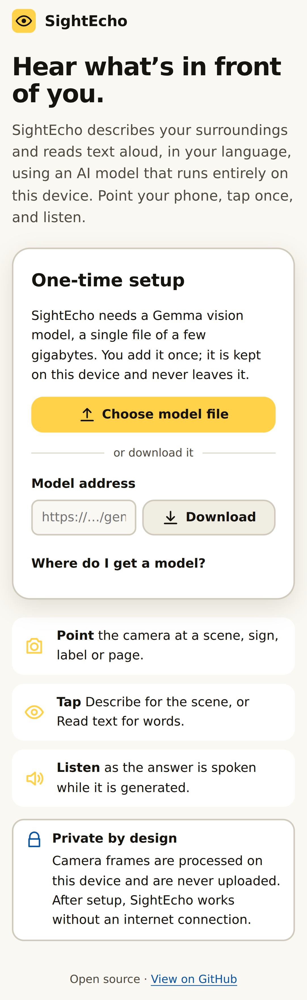
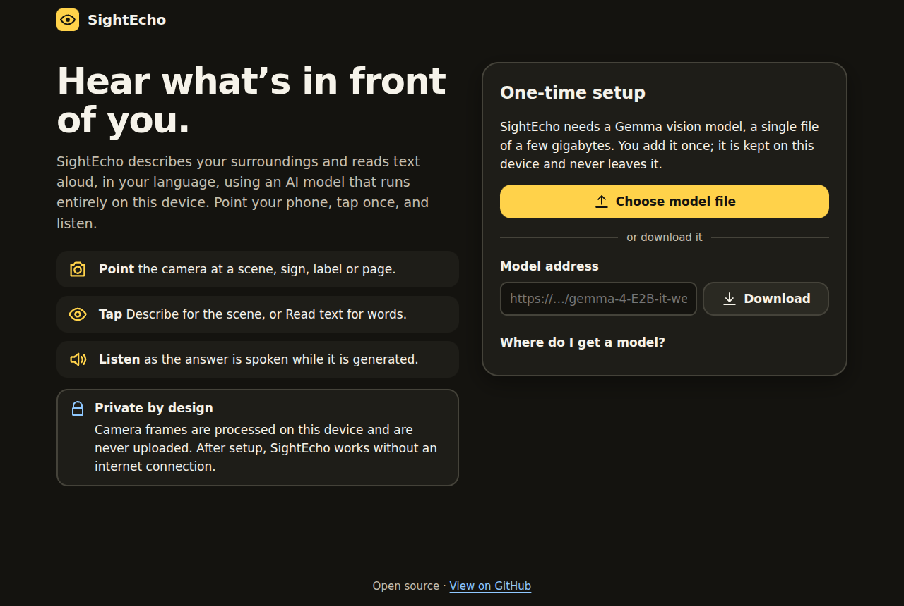
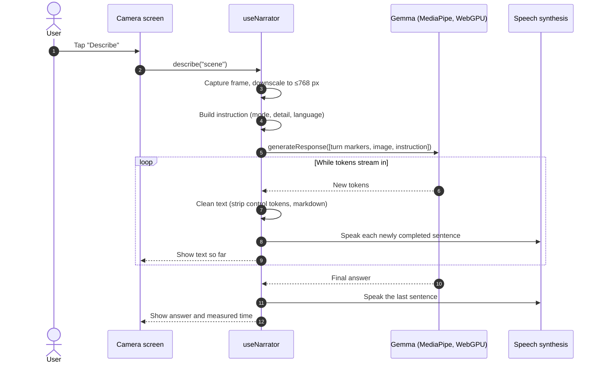
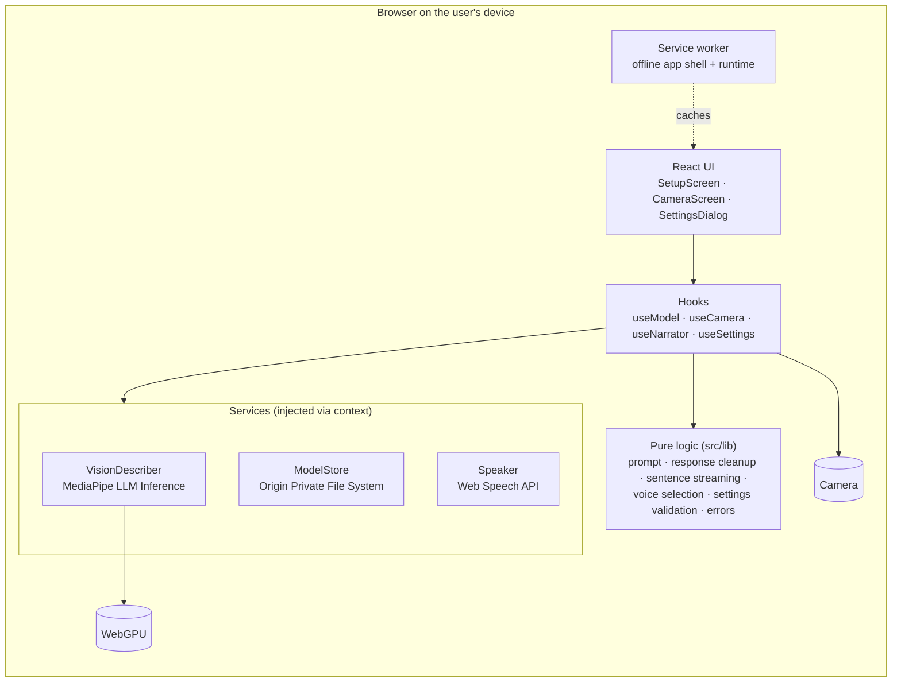
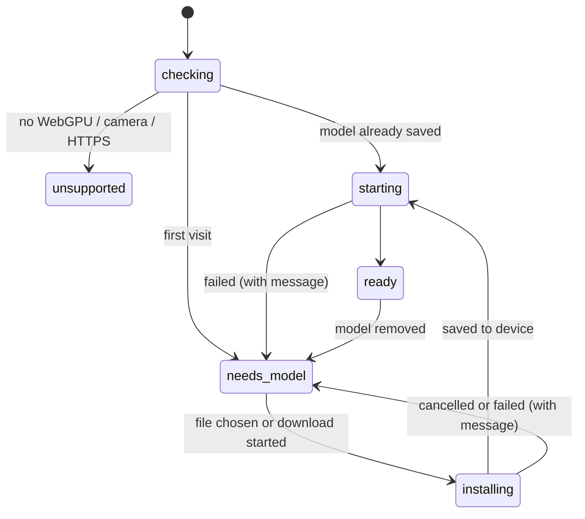

<div align="center">


# SightEcho

**Point your phone. Tap once. Hear what's in front of you.**

SightEcho is a camera narrator for blind and low-vision people. It describes your surroundings and
reads text aloud, in your language, using a Gemma vision model that runs **entirely on your
device**. No account, no subscription, no uploads, and after setup it works offline.

[](https://github.com/sakshamg251206/SightEcho/actions/workflows/ci.yml)


</div>

---

## Contents

- [Why SightEcho exists](#why-sightecho-exists)
- [What it does](#what-it-does)
- [Screenshots](#screenshots)
- [How it works](#how-it-works)
- [Architecture](#architecture)
- [Tech stack](#tech-stack)
- [Project structure](#project-structure)
- [Getting started](#getting-started)
- [Environment variables](#environment-variables)
- [Testing](#testing)
- [Deployment](#deployment)
- [Technical decisions](#technical-decisions)
- [Limitations and future work](#limitations-and-future-work)

## Why SightEcho exists

Many blind and low-vision people already use phone apps that describe photos. Most of them send
each photo to a server. That causes three problems:

1. **Privacy.** A photo of your kitchen, your medicine label or your bank letter leaves your phone.
2. **Connectivity.** No signal means no help: in a basement, on the underground, in rural areas or
   while travelling abroad without data.
3. **Cost.** Somebody pays for the servers, usually through a subscription or ads.

Small multimodal models such as Google's **Gemma 4 E2B** can now run on a phone's graphics chip. SightEcho
uses one to do the whole job on the device, so none of those problems apply.

## What it does

|                                 |                                                                                                                                                                               |
| ------------------------------- | ----------------------------------------------------------------------------------------------------------------------------------------------------------------------------- |
| 👁️ **Describe**                 | Tells you what is in front of you, safety first: obstacles, steps, traffic, people, then layout and objects, with directions such as "on your left".                          |
| 📄 **Read text**                | Reads signs, labels, letters and screens word for word. Foreign text is read and then translated into your language.                                                          |
| 🗣️ **Speaks as it thinks**      | Each sentence is spoken the moment it is complete, instead of waiting for the full answer.                                                                                    |
| 🌍 **20 answer languages**      | From English, Spanish and Hindi to Arabic, Japanese and Tamil. On-device voices are preferred so speech also works offline.                                                   |
| 🔒 **Private and offline**      | Camera frames never leave the device. The model is saved on the device once; the app shell is cached by a service worker.                                                     |
| ♿ **Built for non-visual use** | Huge buttons, tap-anywhere-on-the-camera, vibration on capture, screen reader announcements, keyboard shortcuts, high contrast light and dark themes, reduced-motion support. |

## Screenshots

These are real captures of the app's first-run screen (generated by
[`scripts/capture-screenshots.ts`](scripts/capture-screenshots.ts)). The camera screen needs a
real device, camera and model, so it is not shown here.

<p align="center">
  
  &nbsp;
  
</p>
<p align="center">
  
</p>

## How it works

**In plain words:** the first time, you give SightEcho a model file (download it once; it's a few
gigabytes). SightEcho stores it privately inside the browser. After that, each tap takes a
snapshot from the camera, asks the model about it with carefully written instructions, and speaks
the answer back to you.



## Architecture

The app is a static, client-only progressive web app. There is **no backend**: nothing to run,
pay for or secure on a server.



The model goes through a small, explicit lifecycle, implemented as a pure reducer
([`src/hooks/modelState.ts`](src/hooks/modelState.ts)):



**Key layers**

- **`src/lib`**: pure, framework-free functions holding the product logic. Fully unit tested.
- **`src/services`**: thin adapters around browser and runtime APIs (MediaPipe, OPFS, speech).
  They are passed in through a React context, so the whole UI can be tested with fakes.
- **`src/hooks`**: state and side effects (camera lifecycle, model loading, narration).
- **`src/components`**: presentational components with accessible markup.

## Tech stack

| Area         | Choice                                                                                               | Why                                                                           |
| ------------ | ---------------------------------------------------------------------------------------------------- | ----------------------------------------------------------------------------- |
| On-device AI | [MediaPipe LLM Inference](https://www.npmjs.com/package/@mediapipe/tasks-genai) + Gemma 4 / Gemma 3n | Runs multimodal Gemma on WebGPU in the browser, with streaming output.        |
| UI           | React 19, TypeScript (strict)                                                                        | Small surface, typed end to end.                                              |
| Build        | Vite                                                                                                 | Fast dev server; a small plugin self-hosts the MediaPipe WebAssembly runtime. |
| Storage      | Origin Private File System                                                                           | Streams multi-GB files to disk without holding them in memory.                |
| Speech       | Web Speech API                                                                                       | Built into every major browser, uses the device's own voices.                 |
| Offline      | Hand-written service worker                                                                          | About 90 lines; no extra build tooling.                                       |
| Tests        | Vitest, Testing Library, Playwright                                                                  | Unit, integration (full UI with fakes) and real-browser smoke tests.          |
| Quality      | ESLint, Prettier, GitHub Actions                                                                     | Same checks locally and in CI.                                                |

## Project structure

```text
SightEcho/
├── .github/
│   ├── workflows/ci.yml        # lint, format, typecheck, unit + e2e tests, build
│   ├── workflows/deploy.yml    # manual GitHub Pages deployment
│   └── dependabot.yml
├── docs/screenshots/           # README images (generated)
├── e2e/                        # Playwright smoke tests against the production build
├── public/
│   ├── sw.js                   # service worker (offline support)
│   ├── manifest.webmanifest    # installable app metadata
│   └── icon*.{svg,png}
├── scripts/
│   ├── capture-screenshots.ts  # regenerates docs/screenshots
│   └── generate-icons.ts       # renders PNG icons from icon.svg
├── src/
│   ├── components/             # SetupScreen, CameraScreen, SettingsDialog, UI primitives
│   ├── hooks/                  # useModel (+ modelState reducer), useCamera, useNarrator, useSettings
│   ├── lib/                    # pure logic: prompt, response, sentences, voices, settings, …
│   ├── services/               # MediaPipe describer, OPFS model store, speaker, service worker
│   ├── styles/index.css        # design tokens and all styles
│   ├── App.tsx
│   ├── config.ts               # build-time configuration
│   └── main.tsx                # wires real services into the app
├── tests/                      # Vitest unit and integration tests
├── index.html
└── vite.config.ts
```

## Getting started

### Requirements

- **Node.js 20.19+** (22 recommended, see `.nvmrc`)
- A browser with **WebGPU**: recent Chrome or Edge on Android, Windows, macOS or ChromeOS.
  Safari and Firefox support is still incomplete.
- A device with enough free memory for the model. Phones with less memory should use the smaller
  E2B model.

### Run it locally

```bash
git clone https://github.com/sakshamg251206/SightEcho.git
cd SightEcho
npm install
npm run dev
```

Open the printed URL (usually <http://localhost:5173>). `localhost` counts as a secure context,
so the camera works. To try it on a phone on the same network, serve over HTTPS (for example
through a tunnel), because phones refuse camera access on plain `http://` addresses.

### Get a model

SightEcho does not bundle model weights. They are large and published by Google under the
[Gemma terms of use](https://ai.google.dev/gemma/terms). Download a browser build once:

| Model                                                                                                                                                     | Notes                           |
| --------------------------------------------------------------------------------------------------------------------------------------------------------- | ------------------------------- |
| [Gemma 4 E2B (`gemma-4-E2B-it-web.task`)](https://huggingface.co/litert-community/gemma-4-E2B-it-litert-lm/blob/main/gemma-4-E2B-it-web.task)             | Recommended for phones          |
| [Gemma 4 E4B (`gemma-4-E4B-it-web.task`)](https://huggingface.co/litert-community/gemma-4-E4B-it-litert-lm/blob/main/gemma-4-E4B-it-web.task)             | More capable, needs more memory |
| [Gemma 3n E2B (`gemma-3n-E2B-it-int4-Web.litertlm`)](https://huggingface.co/google/gemma-3n-E2B-it-litert-lm/blob/main/gemma-3n-E2B-it-int4-Web.litertlm) | Previous generation             |

Then choose **Choose model file** in the app, or paste a direct download address. The prompt
format (Gemma 4 or Gemma 3n) is detected from the file name.

### Available scripts

| Command                           | What it does                                        |
| --------------------------------- | --------------------------------------------------- |
| `npm run dev`                     | Start the dev server with hot reload                |
| `npm run build`                   | Typecheck and build to `dist/`                      |
| `npm run preview`                 | Serve the production build locally                  |
| `npm run lint` / `npm run format` | ESLint / Prettier                                   |
| `npm run typecheck`               | TypeScript project check                            |
| `npm test`                        | Unit and integration tests                          |
| `npm run test:coverage`           | Tests with a coverage report                        |
| `npm run test:e2e`                | Playwright smoke tests against the production build |
| `npm run check`                   | Everything CI runs, except e2e                      |

## Environment variables

All are optional. Copy `.env.example` to `.env.local` to set them.

| Variable                         | When  | Purpose                                                                                                                                 |
| -------------------------------- | ----- | --------------------------------------------------------------------------------------------------------------------------------------- |
| `VITE_MODEL_URL`                 | build | Pre-fills the model download field. Must be `https://` and allow CORS from your site. Visible to everyone, so never put a secret in it. |
| `BASE_PATH`                      | build | Sub-path the app is served from, e.g. `/SightEcho/` for GitHub Pages. Defaults to `/`.                                                  |
| `PLAYWRIGHT_CHROMIUM_EXECUTABLE` | tests | Use an existing Chromium instead of Playwright's download.                                                                              |

## Testing

```bash
npm test               # unit and integration tests
npm run test:e2e       # first time: npx playwright install chromium
```

- **Unit tests** (`tests/lib`, `tests/services`, `tests/hooks`) cover the product logic: chat
  templates for each model family, cleanup of control tokens and markdown, sentence streaming
  across scripts (including Japanese), voice selection, settings validation, error messages,
  the model lifecycle reducer, and the model store (incomplete downloads, quota, removal).
- **Integration tests** (`tests/app`) render the whole app with fake camera, model, storage and
  speech, and walk through real flows: first-run setup, returning visits, describing, reading
  text in another language, stopping a slow answer, camera permission errors, keyboard shortcuts,
  settings persistence and model removal.
- **End-to-end tests** (`e2e/`) load the production build in desktop and mobile Chromium and check
  the first-run experience, the manifest, the self-hosted runtime, service worker registration and
  that nothing overflows on a 320 px wide screen.

The model itself cannot run in CI (no GPU and no weights), which is why it sits behind the
`VisionDescriber` interface.

## Deployment

The build output in `dist/` is static files only. Any HTTPS static host works (GitHub Pages,
Netlify, Cloudflare Pages, Vercel, S3 + CloudFront).

**GitHub Pages** (workflow included):

1. In the repository, go to _Settings → Pages_ and set _Source_ to **GitHub Actions**.
2. Optionally add a repository variable `VITE_MODEL_URL`.
3. Run **Deploy to GitHub Pages** from the _Actions_ tab. It builds with
   `BASE_PATH=/<repo-name>/` automatically.

**Anywhere else:**

```bash
BASE_PATH=/ npm run build   # then upload dist/
```

Make sure your host serves `.wasm` files as `application/wasm` (most do by default) and that the
site is on HTTPS, since browsers only allow camera access on secure origins.

## Technical decisions

- **A web app, not a native app.** One codebase reaches Android, desktop and ChromeOS with no app
  store review, and installs to the home screen as a PWA. The trade-off is that the model needs
  WebGPU, which iOS Safari does not fully provide yet.
- **The model is chosen by the user, not bundled.** Gemma weights are several gigabytes and come
  with their own license terms. Hosting them in this repository would be impractical and would
  bypass the licence acceptance step.
- **Stream to disk, then stream to the GPU.** The model file is piped into the Origin Private File
  System with progress reporting and a free-space check, then handed to MediaPipe as a stream
  reader. At no point is a multi-gigabyte copy held in JavaScript memory. Partial downloads are
  deleted, and a model only counts as installed once its metadata file is written.
- **Self-hosted runtime.** The MediaPipe WebAssembly files are served from the app's own origin
  (see the plugin in `vite.config.ts`) instead of a CDN, so they can be cached for offline use.
- **Explicit chat templates.** Gemma 4 and Gemma 3n use different turn markers
  (`<|turn>user … <turn|>` vs `<start_of_turn>user … <end_of_turn>`). Using the wrong ones
  noticeably degrades answers, so the format is picked from the file name and both are tested.
- **Sentence-level speech.** Speaking each completed sentence (split with `Intl.Segmenter`, which
  handles scripts without spaces) means the user hears the most important part, the safety
  information, while the rest is still being generated.
- **Prompting for non-visual use.** The instructions ask for safety-relevant information first,
  egocentric directions ("on your left"), no markdown (it would be read aloud literally) and no
  "the image shows…" filler. Model output is still cleaned defensively.
- **Answers are measured, not promised.** The app shows how long each answer took on the device it
  is running on. Speed varies widely between phones, so the project makes no fixed latency claim.
- **Dependency injection over mocking frameworks.** Hardware and runtime access sits behind small
  interfaces (`VisionDescriber`, `ModelStore`, `Speaker`) provided through React context. Tests
  swap in plain fakes and exercise the real UI.

## Limitations and future work

- **Browser support.** Requires WebGPU. iOS/iPadOS Safari and Firefox are not supported yet.
- **Device requirements.** The model needs a few gigabytes of storage and a good amount of
  graphics memory. Low-end phones may run out of memory; the app explains this when it happens.
- **First load needs a connection** (or a model file already on the device). After that, the app
  and the model work offline.
- **Not a mobility aid.** Descriptions can be wrong or incomplete. SightEcho must not replace a
  cane, a guide dog or human assistance for safety-critical decisions.
- **Voices depend on the device.** If no voice is installed for the chosen language, the app warns
  you in Settings; answers are still shown on screen and announced to screen readers.
- **Not yet tested on a wide range of real devices.** Tests run with fakes and headless Chromium.
  Measured speed and quality on real phones should be gathered before making claims about them.

Ideas for the future:

- Follow-up questions about the same frame ("what colour is the door?").
- Continuous mode that describes changes as you walk, with hazard-only alerts.
- A native wrapper (e.g. LiteRT on Android) for devices without WebGPU.
- A content security policy and automated accessibility audits in CI.

## License

Code: [MIT](LICENSE). Gemma models are not part of this repository and are governed by Google's
[Gemma terms of use](https://ai.google.dev/gemma/terms).
